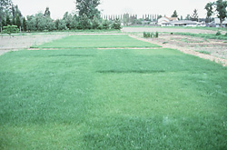

```{r setup, include=FALSE}
knitr::opts_chunk$set(echo = TRUE, message=FALSE, warning=FALSE)
```

# Preparations

Load the necessary libraries

```{r libraries, results='markdown', eval=TRUE}
library(rstanarm)   #for fitting models in STAN
library(coda)       #for diagnostics
library(bayesplot)  #for diagnostics
library(rstan)      #for interfacing with STAN
library(emmeans)    #for marginal means etc
library(broom)      #for tidying outputs
library(tidybayes)  #for more tidying outputs
library(ggeffects)  #for partial plots
library(tidyverse)  #for data wrangling etc
```

# Scenario

Here is an example from @Fowler-1998-1998. An agriculturalist was interested in the effects of fertilizer load on the yield of grass.  Grass seed was sown uniformly over an area and different quantities of commercial fertilizer were applied to each of ten 1 m<sup>2</sup> randomly located plots.  Two months later the grass from each plot was harvested, dried and weighed.  The data are in the file **fertilizer.csv** in the **data** folder.



| FERTILIZER   | YIELD   |
| ------------ | ------- |
| 25           | 84      |
| 50           | 80      |
| 75           | 90      |
| 100          | 154     |
| 125          | 148     |
| \...         | \...    |

---------------- ---------------------------------------------------
**FERTILIZER**:   Mass of fertilizer (g.m^-2^) - Predictor variable
**YIELD**:        Yield of grass (g.m^-2^) - Response variable
---------------- ---------------------------------------------------
 
 
The aim of the analysis is to investigate the relationship between fertilizer concentration and grass yield.

# Read in the data

```{r readData, results='markdown', eval=TRUE}
library(readr)
fert = read_csv('../data/fertilizer.csv', trim_ws=TRUE)
head(fert)
```


# Exploratory data analysis

Model formula:
$$
\begin{align}
y_i &\sim{} \mathcal{N}(\mu_i, \sigma^2)\\
\mu_i &= \beta_0 + \beta_1 x_i\\
\beta_0 &\sim{} \mathcal{N}(0,100)\\
\beta_1 &\sim{} \mathcal{N}(0,10)\\
\sigma &\sim{} \mathcal{cauchy}(0,5)\\
OR\\
\sigma &\sim{} \mathcal{Exp}(1)\\
\end{align}
$$

- Weakly informative priors
  A null prior says any value is possible. We don't almost never want that to be the case. If you allow your prior to be null, you can get nonsense.
  
- The prior on our intercept is a large distribution, centred around zero.
- We will check that they're not influential.
- a half cauchy is something you used to estimate variance, and it is cut in half because it assumes that it doesn't make sense to be less than zero.


# Fit the model

```{r}
summary(lm(YIELD ~ FERTILIZER, data = fert)) #Frequentist
```

[https://github.com/stan-dev/stan/wiki/Prior-Choice-Recommendations]

```{r}
fert.rstanarm = stan_glm(YIELD ~ FERTILIZER, data = fert, iter = 5000, warmup = 500, chains = 3, thin = 2, refresh = 0) #after which iteration should i give you an update of where I'm up to. 0 means give me no updates.
```

```{r}
prior_summary(fert.rstanarm)
#Centred data helps to give the intercept some meaning, simplifies calculations
#Our priors for the intercept are a gaussian 0|10 and for the slope the priors are a gaussian 0|2.5.
#It didn't use a cauchy, but an exponential (rate=1)
```

First time you run the model:
```{r}
fert.rstanopt = stan_glm(YIELD ~ FERTILIZER, data = fert,
                         algorithm = 'optimizing') 
prior_summary(fert.rstanopt)
```

```{r}
fert.rstanarm = stan_glm(YIELD ~ FERTILIZER, data = fert, iter = 5000, 
                         warmup = 500, chains = 3, thin = 2, refresh = 0,
                         prior_intercept = normal(0,100,autoscale = F),
                         prior = norma(0,10, autoscale = F),
                         prior_aux = cauchy(0,5, autoscale = F))
posterior_vs_prior(fert.rstanarm, color_by = 'vs', group_by = T,
                   facet_args = list(scales = 'free_y'))
#you want the priors (in blue), to be larger that the posterior. This implies they were adequetly vague. If they're way to wide, you encourage it to sample wrong values
```

#Diagnostics
```{r}
stan_trace(fert.rstanarm)
#By default is giving us our main effects. We asked for three chains, which are in three colors. They are all random noise, as we want them. It would be bad if any of the colors are above/below. The chains are well mixed. It has replicated the entire likelihood.
```

```{r}
stan_dens(fert.rstanarm, separate_chains = T)
#If we have very large priors, it will reject 
```


# Model validation


# Model investigation / hypothesis testing


```{r mcmcpvalue, results='markdown', eval=TRUE}
mcmcpvalue <- function(samp)
{
    ## elementary version that creates an empirical p-value for the
    ## hypothesis that the columns of samp have mean zero versus a
    ## general multivariate distribution with elliptical contours.
    
    ## differences from the mean standardized by the observed
    ## variance-covariance factor
    
    ## Note, I put in the bit for single terms
    if (length(dim(samp))==0) {
        std <- backsolve(chol(var(samp)),cbind(0, t(samp)) - mean(samp),transpose = TRUE)
        sqdist <- colSums(std * std)
        sum(sqdist[-1] > sqdist[1])/length(samp)
    }
    else {
        std <- backsolve(chol(var(samp)),cbind(0, t(samp)) - colMeans(samp),transpose = TRUE)
        sqdist <- colSums(std * std)
        sum(sqdist[-1] > sqdist[1])/nrow(samp)
    }
    
}
```


# Predictions


# Summary figures


# References

                                 
