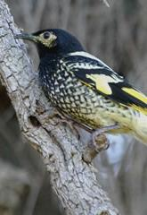

```{r setup, include=FALSE, warnings=FALSE, message=FALSE}
knitr::opts_chunk$set(echo = TRUE)
```

# Preparations

Load the necessary libraries

```{r libraries, results='markdown', eval=TRUE, message=FALSE, warning=FALSE}
library(car)       #for regression diagnostics
library(broom)     #for tidy output
library(ggfortify) #for model diagnostics
library(sjPlot)    #for outputs
library(knitr)     #for kable
library(effects)   #for partial effects plots
library(emmeans)   #for estimating marginal means
library(MASS)      #for glm.nb
library(MuMIn)     #for AICc
library(tidyverse) #for data wrangling
```

# Scenario

@Loyn-1987-1987 modeled the abundance of forest birds with six predictor
variables (patch area, distance to nearest patch, distance to nearest
larger patch, grazing intensity, altitude and years since the patch had
been isolated).

{width="165" height="240"}

Format of loyn.csv data file

ABUND   DIST   LDIST   AREA   GRAZE   ALT   YR.ISOL
------- ------ ------- ------ ------- ----- ---------
..      ..     ..      ..     ..      ..    ..

------------- ------------------------------------------------------------------------------
**ABUND**     Abundance of forest birds in patch- response variable
**DIST**      Distance to nearest patch - predictor variable
**LDIST**     Distance to nearest larger patch - predictor variable
**AREA**      Size of the patch - predictor variable
**GRAZE**     Grazing intensity (1 to 5, representing light to heavy) - predictor variable
**ALT**       Altitude - predictor variable
**YR.ISOL**   Number of years since the patch was isolated - predictor variable
------------- ------------------------------------------------------------------------------

The aim of the analysis is to investigate the effects of a range of predictors on the abundance of forest birds.

# Read in the data

```{r readData, results='markdown', eval=TRUE, warning=FALSE, message=FALSE}
loyn = read_csv('../data/loyn.csv', trim_ws=TRUE)
head(loyn)
```

# Exploratory data analysis

Model formula:
$$
y_i \sim{} \mathcal{N}(\mu_i, \sigma^2)\\
\mu_i = \boldsymbol{\beta} \bf{X_i}
$$

where $\boldsymbol{\beta}$ is a vector of effects parameters and $\bf{X}$ is a model matrix representing the additive effects of
the scaled versions of distance (ln), distance to the nearest large patch (ln), patch area (ln), grazing intensity, year of isolation and 
altitude on the abundance of forest birds.
```{r}
loyn = loyn %>% mutate(fGRAZE=factor(GRAZE))
scatterplotMatrix(~ABUND+DIST+LDIST+AREA+GRAZE+ALT+YR.ISOL, data = loyn,
                  diagonal = list(method ='boxplot'))
scatterplotMatrix(~ABUND+log(DIST)+log(LDIST)+log(AREA)+GRAZE+ALT+YR.ISOL, 
                  data = loyn,
                  diagonal = list(method ='boxplot'))
loyn.lm = lm(ABUND~scale(log(DIST))+scale(log(LDIST))+scale(log(AREA)) +fGRAZE +scale(ALT) +scale(YR.ISOL), data = loyn)

vif(loyn.lm)
autoplot(loyn.lm, which=1:6)
#the lower end of the normal distribution, is cut off, which explains why the #qqplot shows a deviation from normality. But because our model is fairly #robust to nonnormality, it is okay. 
```


```{r}
plot(allEffects(loyn.lm, residuals = T),type = 'response')
```
```{r}
summary(loyn.lm)
#the intercept usually doesn't have an interpretation, but this time we centred our data. When all of the others are at their mean, and grazing is at 1, bird abundance is at 22.5 birds
#for every 1 unit change in area on a log scale, you get 5.5 more birds
```

```{r}
confint(loyn.lm)
```

## Option 1 - dredge
```{r}
loyn.lm = update(loyn.lm, na.action = na.fail) #dredge
dredge(loyn.lm, rank = "AICc")

```
The first intercept at 22.47, only includes grazing and AREA. AIC has ranked the model with only these two, as the best model.
Delta compares the model with the best model. Any that are within two units, will be good. In this case, the most parsimmonous model, is the one that only has grazing and area, the rest are not required.

# Fit the model


# Model validation


# Model investigation / hypothesis testing


# Predictions {.tabset .tabset-faded}

## Option 2 - model averaging
Select models within a delta range, say 4, and we average them together. We use weighted average. 
```{r}
loyn.av = model.avg(dredge(loyn.lm, rank = "AICc"), subset = delta<=4)
summary(loyn.av)
#It produces two sets of outputs:
#FULL AND CONDITIONAL AVERAGE

#conditional average assumes that all variables are always present. Because of that, it adjust where they are present.

#The full average model will put zeros where variables are absent, and it lowers the bias. the conditional average introduces bias, because it prefers high values?
```


## Option 3 - explore a small set of models - the preferred approach
- Propose some models, and test those particular models
- Each of them speaks of another aspect of ecology
- We might fit a model focusing on connectivity. Is distance important in how these birds are dispersed? 
- We might have another one with the characteristics of the patch themselves 

```{r}
loyn.lm1 = update(loyn.lm, .~scale(log(DIST))+scale(log(LDIST)))
loyn.lm2 = update(loyn.lm, .~scale(log(AREA))+ fGRAZE + scale(YR.ISOL))
loyn.lm3 = update(loyn.lm, .~scale(log(AREA))+ fGRAZE)
loyn.lm4 = update(loyn.lm, .~scale(ALT))
loyn.null = update(loyn.lm, .~1) #along with good candidate models, you have 1 that has nothing in it at all. If the AIC turns out to be higher for the model you're comparing to the null model,clearly adding the variable is doing nothing.

AICc(loyn.lm, loyn.lm1, loyn.lm2, loyn.lm3, loyn.lm4, loyn.null)
#The model that was just about distance, is not useful at all. The distance between habitats doesn't seem to be an issue. AIC value is greater than null model.
#ALtitude is only marginally better
#Models about habitat, grazing and years of isolation are significanlt better.
```


# Summary figures
We have identified that area and grazing is important. The dredging suggests that the model with just area and grazing is the best model.
1. Make a grid
```{r}
loyn.grid = list(fGRAZE = levels(loyn$fGRAZE),
                 AREA=seq(min(loyn$AREA), max(loyn$AREA), len = 100))
newdata = emmeans(loyn.lm3, ~AREA|fGRAZE, at=loyn.grid) %>% #look at the effect of area conditional on grazing
  as.data.frame()
newdata
```

```{r}
ggplot(newdata, aes(AREA, emmean, color = fGRAZE, fill = fGRAZE)) +
  geom_ribbon(aes(ymin = lower.CL, ymax = upper.CL), color= NA, alpha = 0.3) + geom_line() + theme_classic() +
  scale_x_log10(labels=scales::comma) +
  scale_y_continuous('Abundance') 
```

# Further/alternative analyses
For an area of 0.1,we have negative abundance of birds. Maybe gamma would've been more appropriate.

We can try fitting a multiplicative model:
```{r}
loyn.glm = glm(ABUND~scale(log(AREA))* fGRAZE, data = loyn,family = Gamma(link = 'log'))
loyn.glm1 = glm(ABUND~scale(log(AREA))+ fGRAZE, data = loyn,family = Gamma(link = 'log'))
AICc(loyn.glm, loyn.glm1) #corrected for small sample sizes (<30)
```
```{r}
anova(loyn.glm,loyn.glm1,test = 'Chisq')
#This test implis that the multiplicative model is better than the additive
#Having consumed 11 df, there are 46 df resid for model 1. 
#In the base of AIC,they're both about the same, we might as well keep the more simple one
#ANOVA shows different results.
```
 
SO we plot it:
```{r}
loyn.grid = list(fGRAZE=levels(loyn$fGRAZE),
                 AREA = seq(min(loyn$AREA), max(loyn$AREA), len = 100))
newdata = emmeans(loyn.glm, ~AREA|fGRAZE, at=loyn.grid, type = 'response') %>% as.data.frame()
newdata

#we use asymptotic conf int because of the difficulty of calculating df
ggplot(newdata, aes(AREA, response, color = fGRAZE, fill = fGRAZE)) +
  geom_ribbon(aes(ymin = asymp.LCL, ymax = asymp.UCL), color= NA, alpha = 0.3) + geom_line() + theme_classic() +
  scale_x_log10(labels=scales::comma) +
  scale_y_log10('Abundance')
```
Interestingly, the trend of area and abundance is more extreme for grazing level 4. 

# References
