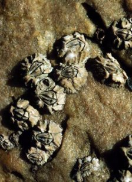

```{r setup, include=FALSE, warnings=FALSE, message=FALSE}
knitr::opts_chunk$set(echo = TRUE)
```

# Preparations

Load the necessary libraries

```{r libraries, results='markdown', eval=TRUE, message=FALSE, warning=FALSE}
library(car)       #for regression diagnostics
library(broom)     #for tidy output
library(ggfortify) #for model diagnostics
library(sjPlot)    #for outputs
library(knitr)     #for kable
library(effects)   #for partial effects plots
library(emmeans)   #for estimating marginal means
library(MASS)      #for glm.nb
library(MuMIn)     #for AICc
library(tidyverse) #for data wrangling
```

# Scenario

Here is a modified example from @Quinn-2002-2002. Day and Quinn
(1989) described an experiment that examined how rock surface type
affected the recruitment of barnacles to a rocky shore. The experiment
had a single factor, surface type, with 4 treatments or levels: algal
species 1 (ALG1), algal species 2 (ALG2), naturally bare surfaces (NB)
and artificially scraped bare surfaces (S). There were 5 replicate plots
for each surface type and the response (dependent) variable was the
number of newly recruited barnacles on each plot after 4 weeks.

{width="224" height="308"}

Format of day.csv data files

TREAT   BARNACLE
------- ----------
ALG1    27
..      ..
ALG2    24
..      ..
NB      9
..      ..
S       12
..      ..

-------------- ----------------------------------------------------------------------------------------------------------------------------------------------
**TREAT**      Categorical listing of surface types. ALG1 = algal species 1, ALG2 = algal species 2, NB = naturally bare surface, S = scraped bare surface.
**BARNACLE**   The number of newly recruited barnacles on each plot after 4 weeks.
-------------- ----------------------------------------------------------------------------------------------------------------------------------------------

# Read in the data

```{r readData, results='markdown', eval=TRUE}
day = read_csv('../data/day.csv', trim_ws=TRUE)
day = day %>% mutate(TREAT = factor(TREAT))
glimpse(day)
```


# Exploratory data analysis

Model formula:
$$
y_i \sim{} \mathcal{Pois}(\lambda_i)\\
\mu_i = \boldsymbol{\beta} \bf{X_i}
$$

where $\boldsymbol{\beta}$ is a vector of effects parameters and $\bf{X}$ is a model matrix representing the intercept and treatment contrasts for the effects of Treatment on barnacle recruitment.
```{r}
day %>% ggplot(aes(TREAT,log(BARNACLE))) + geom_boxplot()
```


# Fit the model

```{r fitModel, results='markdown', eval=TRUE}
#Effects model
#contrasts(day$TREAT)
model.matrix(~TREAT, data=day)

mm <- model.matrix(~TREAT, data=day)

##latex-math-preview-expression
##$Barnacle_{i} = \mu + \alpha_{Treatment_j} +\varepsilon_i \hspace{1cm} \varepsilon \sim{} \mathcal{N}(0, \sigma^2)$
#we could solve the whole thing as
# solve(X'X)X'Y
solve(t(mm) %*% mm) %*% t(mm) %*% day$BARNACLE

```

```{r fitModel1, results='markdown', eval=TRUE}
day.glm <- glm(BARNACLE~TREAT, data=day, family='gaussian')
day.glm1 <- glm(BARNACLE~TREAT, data=day, family='poisson')
```

# Model validation {.tabset .tabset-faded}

## Gaussian

```{r validateModel, results='markdown', eval=TRUE}
autoplot(day.glm)
#cooks d is how much something is an outlier om the x and y axis. y axis is the residuals, x axis is leverage. when you only have categorical values in the x axis, cooksd doesn't make any sense.
```

## Poisson

```{r validateModel1, results='markdown', eval=TRUE}
autoplot(day.glm1)
```

```{r validateModel2, results='markdown', eval=TRUE}
## overdispersion
1-pchisq(day.glm1$deviance,day.glm1$df.residual)
day.glm1$deviance/day.glm1$df.residual #divide deviance by residual degrees of freedom. We don't want it to be more than one, so in this case, poisson is a good way to go
```

# 

Comparison

```{r AIC, results='markdown', eval=TRUE}
AIC(day.glm, day.glm1)
```
We go for the simpler model that has consumed less degrees of freedom.

# Model investigation / hypothesis testing {.tabset .tabset-faded}

## Gaussian

```{r effectsPlot, results='markdown', eval=TRUE}
plot(allEffects(day.glm))
```
The effects plot is showing that NB and S have lower barnacle predictions.

```{r summariseModel, results='markdown', eval=TRUE}
summary(day.glm)
#intercept in ANOVA -> mean of the first group. 22.4 is the barnacle abundance in treatment ALG1. on average there are 6 more barnacles in ALG2 than ALG1, which we can also see in the effects plot. NB treatment is 7.4 below ALG1 group.
tidy(day.glm,conf.int=TRUE) #Gaussian
anova(day.glm, test='Chisq')
```

## Poisson

```{r effectsPlot1, results='markdown', eval=TRUE}
plot(allEffects(day.glm1))
plot(allEffects(day.glm1), type='link')
```

```{r summariseModel1, results='markdown', eval=TRUE}
summary(day.glm1)
#Because of the log link
#exp(0.237) = 1.267, thus ALG2 has 1.267 times more barnacles than ALG1

tidy(day.glm1,conf.int=TRUE) #Poisson in log scale
tidy(day.glm1,conf.int=TRUE, exponentiate=TRUE) #Poisson reverse log
exp(coef(day.glm1))
##log(A) + log(B) = log(A*B)
##exp(A)*exp(B) = exp(A+B)
22.4+6
22.4*1.268
summary(day.glm1)
confint(day.glm1)
anova(day.glm1, test='Chisq')

```

# Predictions

## Post-hoc test (Tukey's)
- Bonferroni
- Tukey
-- Compare every group to every other group

```{r predictions, results='markdown', eval=TRUE}
emmeans(day.glm1,pairwise ~TREAT, type='response') #when you ask it to do pairwise comparisons, you're basically asking for TukeyHSD
#no evidence that ALG1&ALG2 are different. NB&S are also not different.
confint(emmeans(day.glm1,pairwise ~TREAT, type='response'))
```

## Planned contrasts

Define your own

Compare:

a) average of ALG1+ALG2 vs NB+S
b) ALG1 vs ALG2
c) NB vs S

#Contrast matrix
```{r planned, results='markdown', eval=TRUE}
#      Contr 1 Contr 2 Contr 3
#ALG1  0.5      1       0
#ALG2  0.5     -1       0
#  NB -0.5      0       1
#   S -0.5      0      -1
cmat<-(cbind('Alg1_Alg2'=c(1,-1,0,0),
              'NB_S'=c(0,0,1,-1),
             'Alg_Bare'=c(0.5,0.5,-0.5,-0.5)))
#MY CONTRAST MATRIX:
#     Alg1_Alg2 NB_S Alg_Bare
#[1,]         1    0      0.5
#[2,]        -1    0      0.5
#[3,]         0    1     -0.5
#[4,]         0   -1     -0.5
#ALL COMPARISONS MUST BE ORTHOGONAL : The three effects must still add up to the full model. The comparisons must still be independent

crossprod(cmat) #checks if all groups are independent
#          Alg1_Alg2 NB_S Alg_Bare
#Alg1_Alg2         2    0        0
#NB_S              0    2        0
#Alg_Bare          0    0        1
#As long as the upper quadrat and the lower quadrat are zeros, they are independent
```

```{r}
emmeans(day.glm, ~TREAT, contr=list(TREAT=cmat))
                                        
emmeans(day.glm1, ~TREAT, contr=list(TREAT=cmat), type='link')
emmeans(day.glm1, ~TREAT, contr=list(TREAT=cmat), type='response')
confint(emmeans(day.glm1, ~TREAT, contr=list(TREAT=cmat)),
                type='response')
```


# Summary figures

```{r summaryFig, results='markdown', eval=TRUE}
newdata = emmeans(day.glm1, ~TREAT, type='response') %>%
    as.data.frame
newdata

ggplot(newdata, aes(y=rate, x=TREAT)) +
    geom_pointrange(aes(ymin=asymp.LCL, ymax=asymp.UCL)) +
    theme_classic()

ggplot(newdata, aes(y=rate, x=TREAT)) +
    geom_pointrange(aes(ymin=asymp.LCL, ymax=asymp.UCL))+
    geom_point()+
    scale_x_discrete('Treatment', breaks=c('ALG1','ALG2','NB','S'),
       labels=c('Algae spp 1', 'Algae spp 2', 'Naturally bare', 'Scraped bare'))+
    scale_y_continuous(expression(Number~of~newly~recruited~barnacles~(cm^2)))+
    theme_classic()

```


# References
