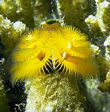

```{r setup, include=FALSE, warnings=FALSE, message=FALSE}
knitr::opts_chunk$set(echo = TRUE)
```

# Preparations

Load the necessary libraries

```{r libraries, results='markdown', eval=TRUE, message=FALSE, warning=FALSE}
library(car)       #for regression diagnostics
library(broom)     #for tidy output
library(ggfortify) #for model diagnostics
library(sjPlot)    #for outputs
library(knitr)     #for kable
library(effects)   #for partial effects plots
library(emmeans)   #for estimating marginal means
library(MASS)      #for glm.nb
library(MuMIn)     #for AICc
library(tidyverse) #for data wrangling
```

# Scenario

{width="157" height="160"}

In an attempt to understand the effects on marine animals of short-term
exposure to toxic substances, such as might occur following a spill, or
a major increase in storm water flows, a it was decided to examine the
toxicant in question, Copper, as part of a field experiment in Hong
Kong. The experiment consisted of small sources of Cu (small,
hemispherical plaster blocks, impregnated with copper), which released
the metal into sea water over 4 or 5 days. The organism whose response
to Cu was being measured was a small, polychaete worm, Hydroides, that
attaches to hard surfaces in the sea, and is one of the first species to
colonize any surface that is submerged. The biological questions focused
on whether the timing of exposure to Cu affects the overall abundance of
these worms. The time period of interest was the first or second week
after a surface being available.

The experimental setup consisted of sheets of black perspex (settlement
plates), which provided good surfaces for these worms. Each plate had a
plaster block bolted to its centre, and the dissolving block would
create a gradient of [Cu] across the plate. Over the two weeks of the
experiment, a given plate would have plain plaster blocks (Control) or a
block containing copper in the first week, followed by a plain block, or
a plain block in the first week, followed by a dose of copper in the
second week. After two weeks in the water, plates were removed and
counted back in the laboratory. Without a clear idea of how sensitive
these worms are to copper, an effect of the treatments might show up as
an overall difference in the density of worms across a plate, or it
could show up as a gradient in abundance across the plate, with a
different gradient in different treatments. Therefore, on each plate,
the density of worms (\#/cm^2^) was recorded at each of four distances
from the center of the plate.

Format of copper.csv data file

COPPER   PLATE   DIST   WORMS   AREA   COUNT
-------- ------- ------ ------- ------ -------
..       ..      ..     ..      ..     ..

------------ -----------------------------------------------------------------------------------------------------------------------------------------------------------------------------------------------------------------------------------------
**COPPER**   Categorical listing of the copper treatment (control = no copper applied, week 2 = copper treatment applied in second week and week 1= copper treatment applied in first week) applied to whole plates. Factor A (between plot factor).
**PLATE**    Substrate provided for polychaete worm colonization on which copper treatment applied. These are the plots (Factor B). Numbers in this column represent numerical labels given to each plate.
**DIST**     Categorical listing for the four concentric distances from the center of the plate (source of copper treatment) with 1 being the closest and 4 the furthest. Factor C (within plot factor)
**WORMS**    Density (\#/cm~2~) of worms measured. Response variable.
------------ -----------------------------------------------------------------------------------------------------------------------------------------------------------------------------------------------------------------------------------------

# Read in the data

```{r readData, results='markdown', eval=TRUE}
copper = read_csv('../data/copper.csv', trim_ws=TRUE)
glimpse(copper)
```


# Exploratory data analysis

Model formula:
$$
y_i \sim{} \mathcal{Pois}(\lambda_i)\\
ln(\lambda_i) =\boldsymbol{\beta} \bf{X_i} + \boldsymbol{\gamma} \bf{Z_i}
$$

where $\boldsymbol{\beta}$ and $\boldsymbol{\gamma}$ are vectors of the fixed and random effects parameters respectively 
and $\bf{X}$ is the model matrix representing the overall intercept and effects of copper, distance and their interaction on the number of number of worms.
Area of the place segment was also incorporated as an offset.
$\bf{Z}$ represents a cell means model matrix for the random intercepts associated with individual plates.

```{r}
copper = copper %>% mutate(COPPER = factor(COPPER), PLATE = factor(PLATE), DIST = factor(DIST))
```

```{r}
ggplot(copper, aes(y = WORMS, x= DIST, fill = COPPER)) + 
  geom_boxplot()
ggplot(copper, aes(y = WORMS, x= DIST, fill = COPPER)) +
  geom_boxplot() +
  scale_y_log10()
ggplot(copper, aes(y = log(WORMS), x= DIST, fill = COPPER)) +
  geom_boxplot()
ggplot(copper, aes(y = WORMS, x= DIST, fill = COPPER)) +
  geom_boxplot() +
  scale_y_sqrt()
```


# Fit the model
```{r}
library(glmmTMB)
copper.glmmTMB = glmmTMB(I(WORMS+0.5) ~ COPPER*DIST + (1|PLATE), 
                         data = copper, family = Gamma(link = 'log'))
ggplot(copper, aes(y = WORMS, x= as.numeric(PLATE), color = DIST)) +
  geom_line() + facet_wrap(~COPPER)
copper.glmmTMB1 = glmmTMB(I(WORMS+0.5) ~ COPPER*DIST + (DIST|PLATE),
                          data = copper, family = Gamma(link = 'log'))
ggplot()+ 
  geom_point(data = NULL,
             aes(y = residuals(copper.glmmTMB, type = 'pearson'),
                 x = fitted(copper.glmmTMB)))
ggplot()+ 
  geom_point(data = NULL,
             aes(y = residuals(copper.glmmTMB1, type = 'pearson'),
                 x = fitted(copper.glmmTMB1)))
```

```{r}
copper.glmmTMB2 = glmmTMB(I(WORMS+0.5) ~ COPPER*DIST+ (1|PLATE), 
                          data = copper, family = tweedie(link = 'log'))
#It enables the model to have some features similar to gamma or poisson, depending on what it needs.
ggplot()+ 
  geom_point(data = NULL,
             aes(y = as.vector(residuals(copper.glmmTMB2)),
                 x = fitted(copper.glmmTMB2)))
```

```{r}
summary(copper.glmmTMB2)
```


# Model validation
```{r}
plot(allEffects(copper.glmmTMB2,
                transformation = list(link = log, inverse = exp)),
     multiline = TRUE, ci.style = 'bars') #effects plot back transformed
```


1. Interactions:
- Week 2 deviates from control, whereas W1 follows the same trend
- We will want to compare the effect of copper in each of the distances separate

# Model investigation / hypothesis testing

```{r}
#4 sets of Tukeys tests to test the effect of COPPER in each DIST
emmeans(copper.glmmTMB2, pairwise ~ COPPER|DIST, type = 'response')$contrasts
#we want to have a look at the contrasts, and not emmeans
# DIST 4: suggests that control is higher than W1 (34%), and W2 (68%). W1 is 26% higher than W2. 
# DIST 3: the effects are larger, 43%, 187% and 100% from W1 to W2.
# These trends are even greater at DIST 2 and greater in DIST 1. 
```

```{r}
emmeans(copper.glmmTMB2, pairwise ~ DIST|COPPER, type = 'response') $contrasts
#ALl comparisons have come out as significant, but because of TUKEY we have reduced power. 
#1/0.908 = 1.101 the test detected the 10% change from DIST1 to DIST2 in control
#the test says its significant, but looking at the effect size, we say it is not ecologically important
#1/0.9833 = 1.016984  -> 0.16% change from DIST2 to DIST3 in W1. it shows as significant, but the effect size is way too small to be ecologically significant
```

# Predictions

```{r}
newdata = confint(emmeans(copper.glmmTMB2,
                          pairwise~COPPER|DIST, type = 'response'))$contrasts %>% as.data.frame()
head(newdata)

g1 = ggplot(newdata, aes(y=ratio, x =contrast, color =DIST ))+ geom_pointrange(aes(ymin=lower.CL, ymax = upper.CL), position = position_dodge(width = 0.6)) + 
  geom_hline(yintercept = 1) +
  scale_y_log10() +
  coord_flip() +
  theme_bw()
g1
```

```{r}
newdata = confint(emmeans(copper.glmmTMB2, ~COPPER|DIST, type = 'response')) %>% as.data.frame()
g2 = ggplot(newdata, aes(y=response, x =DIST, fill = COPPER))+ geom_pointrange(aes(ymin=lower.CL, ymax = upper.CL), shape = 21) + 
  scale_y_log10() +
  coord_flip() +
  theme_bw()
library(gridExtra)
grid.arrange(g1, g2, nrow = 1) #allows you to put together unrelated graphs
grid.arrange(g1 + ggtitle('a)'), g2 + ggtitle('b)'), nrow = 1)
```


# Summary figures

# References
