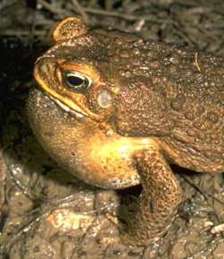

```{r setup, include=FALSE, warnings=FALSE, message=FALSE}
knitr::opts_chunk$set(echo = TRUE)
```

# Preparations

Load the necessary libraries

```{r libraries, results='markdown', eval=TRUE, message=FALSE, warning=FALSE}
library(car)       #for regression diagnostics
library(broom)     #for tidy output
library(ggfortify) #for model diagnostics
library(sjPlot)    #for outputs
library(knitr)     #for kable
library(effects)   #for partial effects plots
library(emmeans)   #for estimating marginal means
library(MASS)      #for glm.nb
library(MuMIn)     #for AICc
library(tidyverse) #for data wrangling
```

# Scenario

In an honours thesis from (1992), Mullens was investigating the ways
that cane toads ( Bufo marinus ) respond to conditions of hypoxia. Toads
show two different kinds of breathing patterns, lung or buccal,
requiring them to be treated separately in the experiment. Her aim was
to expose toads to a range of O~2~ concentrations, and record their
breathing patterns, including parameters such as the expired volume for
individual breaths. It was desirable to have around 8 replicates to
compare the responses of the two breathing types, and the complication
is that animals are expensive, and different individuals are likely to
have different O~2~ profiles (leading to possibly reduced power). There
are two main design options for this experiment;

-   One animal per O~2~ treatment, 8 concentrations, 2 breathing types.
    With 8 replicates the experiment would require 128 animals, but that
    this could be analysed as a completely randomized design
-   One O~2~ profile per animal, so that each animal would be used 8
    times and only 16 animals are required (8 lung and 8 buccal
    breathers)

Mullens decided to use the second option so as to reduce the number of
animals required (on financial and ethical grounds). By selecting this
option, she did not have a set of independent measurements for each
oxygen concentration, by repeated measurements on each animal across the
8 oxygen concentrations.

{width="251" height="290"}

Format of mullens.csv data file

BREATH   TOAD   O2LEVEL   FREQBUC   SFREQBUC
-------- ------ --------- --------- ----------
lung     a      0         10.6      3.256
lung     a      5         18.8      4.336
lung     a      10        17.4      4.171
lung     a      15        16.6      4.074
\...     \...   \...      \...      \...

-------------- ---------------------------------------------------------------------------------------------------------------------------------------------------------------------------------------------------------------------------------------------------------------------------------------------------------------------------------------------------
**BREATH**     Categorical listing of the breathing type treatment (buccal = buccal breathing toads, lung = lung breathing toads). This is the between subjects (plots) effect and applies to the whole toads (since a single toad can only be one breathing type - either lung or buccal). Equivalent to Factor A (between plots effect) in a split-plot design
**TOAD**       These are the subjects (equivalent to the plots in a split-plot design: Factor B). The letters in this variable represent the labels given to each individual toad.
**O2LEVEL**    0 through to 50 represent the the different oxygen concentrations (0% to 50%). The different oxygen concentrations are equivalent to the within plot effects in a split-plot (Factor C).
**FREQBUC**    The frequency of buccal breathing - the response variable
**SFREQBUC**   Square root transformed frequency of buccal breathing - the response variable
-------------- ---------------------------------------------------------------------------------------------------------------------------------------------------------------------------------------------------------------------------------------------------------------------------------------------------------------------------------------------------


### DID THE FREQUENCY OF BUCCAL BREATHING CHANGE WITH O2 CONCENTRATION

# Read in the data

```{r readData, results='markdown', eval=TRUE}
mullens = read_csv('../data/mullens.csv', trim_ws=TRUE)
glimpse(mullens)
```

```{r}
mullens = mullens %>% mutate(BREATH = factor(BREATH), TOAD = factor(TOAD))
mullens = mullens %>% mutate(pBUC = FREQBUC/100, pzBUC = ifelse(pBUC==0,0.0001, pBUC)) #if the value of pBUC is zero, we replace is with 0.0001, because gamma distribution can't do zeros
```

# Exploratory data analysis

Model formula:
$$
y_i \sim{} \mathcal{Pois}(\lambda_i)\\
ln(\lambda_i) =\boldsymbol{\beta} \bf{X_i} + \boldsymbol{\gamma} \bf{Z_i}
$$
```{r}
ggplot(mullens, aes(O2LEVEL, pzBUC, color = BREATH)) + geom_smooth() +
  geom_point()
#We will try to fit a linear model, with a nonlinear curve. It is still a linear combination of the betas, thus a linear model, despite the curve.
```

where $\boldsymbol{\beta}$ and $\boldsymbol{\gamma}$ are vectors of the fixed and random effects parameters respectively 
and $\bf{X}$ is the model matrix representing the overall intercept and effects of copper, distance and their interaction on the number of number of worms.
Area of the place segment was also incorporated as an offset.
$\bf{Z}$ represents a cell means model matrix for the random intercepts associated with individual plates.


# Fit the model

```{r}
library(glmmTMB)
mullens.glmmTMB = glmmTMB(pzBUC ~ BREATH*poly(O2LEVEL,3) + (1|TOAD), 
                          data = mullens, family = beta_family(link = "logit")) 
#it will fit up to a third level polynomial
#glm and glmer won't do beta. only glmmTMB uses beta_family
#poly will fit a polynomial, but will make sure that the linear and quadratic components will be independent, and they can be measured independently

mullens.glmmTMB1 = glmmTMB(pzBUC ~ BREATH*poly(scale(O2level), 3) +
                             (poly(scale(O2level), 3)|TOAD), data = mullens, family = beta_family(link = "logit")
```

# Model validation

```{r}
ggplot() +
  geom_point(data = NULL, aes(y = resid(mullens.glmmTMB), x = fitted(mullens.glmmTMB)))
```


# Model investigation / hypothesis testing

```{r}
summary(mullens.glmmTMB)
#BREATHlung                   -0.85089    0.26809  -3.174   0.0015 ** 
#It says they're a difference between buccal and lung, but only for a single oxygen levels. Doesn't hold true for all oxygen levels, it is not consistent because there are interactions
#poly(O2LEVEL, 3)1            -6.37285    0.71828  -8.872  < 2e-16 ***
#there is evidence of a declining trend for buccal breathers. but no evidence for quadratic or polynomial

#BREATHlung:poly(O2LEVEL, 3)1 10.48385    1.45749   7.193 6.33e-13 ***
#the lung breathers don't have the same linearity component as the buccal breathers.

#The buccal breathers didn't have a quadratic component.
#BREATHlung:poly(O2LEVEL, 3)2 -6.57740    1.32279  -4.972 6.61e-07 ***
#The lung breathers have a different quadratic component different to that of buccal breathers. Because the buccal breathers don't have a quadratic component, the lung breathers will have it.
#BREATHlung:poly(O2LEVEL, 3)3  3.04981    1.28491   2.374   0.0176 *  
#Same argument goes for cubic. The buccal breathers didn't have a cubic component, but the lung breathers have a slight cubic component.

```
```{r}
plot(allEffects(mullens.glmmTMB))
```

# Predictions

```{r}
emmeans(mullens.glmmTMB, ~O2LEVEL|BREATH, type = 'response')
```

```{r}
mullens.grid = with(mullens, list(BREATH = levels(BREATH), 
                                  O2LEVEL = seq(min(O2LEVEL), max(O2LEVEL), len = 100)))
newdata = emmeans(mullens.glmmTMB, ~O2LEVEL|BREATH, at = mullens.grid, type = 'response') %>% as.data.frame()
head(newdata)
```

# Summary figures

```{r}
ggplot() +
  geom_ribbon(data =newdata, aes(ymin = lower.CL, ymax= upper.CL, x = O2LEVEL, fill = BREATH), alpha = 0.3) +
  geom_line(data = newdata, aes(y = prop, x = O2LEVEL, color = BREATH)) +
  theme_classic()
```

# References
