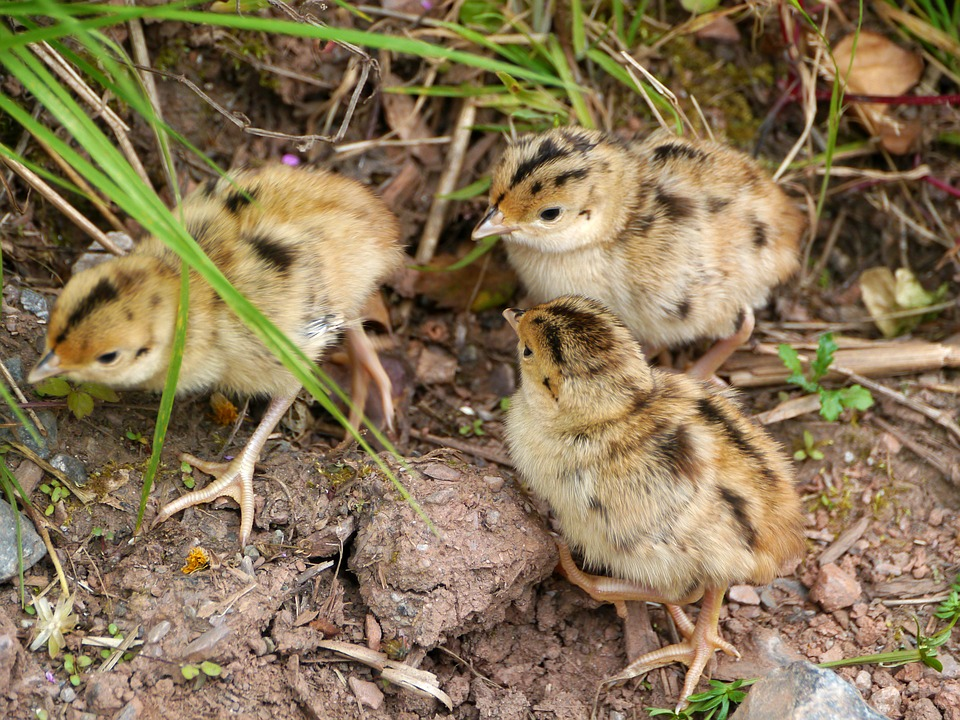

```{r setup, include=FALSE, warnings=FALSE, message=FALSE}
knitr::opts_chunk$set(echo = TRUE)
```

# Preparations

Load the necessary libraries

```{r libraries, results='markdown', eval=TRUE, message=FALSE, warning=FALSE}
library(car)       #for regression diagnostics
library(broom)     #for tidy output
library(ggfortify) #for model diagnostics
library(sjPlot)    #for outputs
library(knitr)     #for kable
library(effects)   #for partial effects plots
library(emmeans)   #for estimating marginal means
library(MASS)      #for glm.nb
library(MuMIn)     #for AICc
library(tidyverse) #for data wrangling
```

# Scenario


Elston explored the effects of year, altitude, location, 
and brood effects of sheep ticks *Ixodes ricinus* on red grouse 
*Lagopus lagopus scoticus* chicks.


{width="251" height="290"}

Format of elston.csv data file

INDEX TICKS BROOD ALTITUDE YEAR LOCATION 
----- ----- ----- -------- ---- -------- 
1     0     32501 465      95   32       
2     0     32501 465      95   32       
3     0     36502 472      95   36       
4     0     37503 475      95   37       
5     0     37503 475      95   37       
6     3     37503 475      95   37       
\...  \...  \...  \...     \... \...     

-------------- ---------------------------------------------------------------------------------------------------------------------------------------------------------------------------------------------------------------------------------------------------------------------------------------------------------------------------------------------------
**INDEX**     An integer between 1 and the number of rows that uniquely identifies each individual record
**TICKS**     The response - the number of ticks on the chick.
**BROOD**     A random effect indicating which brood the chick comes from.
**ALTITUDE**  The altitude (a continuous covariate)
**YEAR**      Year - the main covariate
**LOCATION**  A random effect

-------------- ---------------------------------------------------------------------------------------------------------------------------------------------------------------------------------------------------------------------------------------------------------------------------------------------------------------------------------------------------

# Read in the data

```{r readData, results='markdown', eval=TRUE}
elston = read_csv('../data/elston.csv', trim_ws=TRUE)
glimpse(elston)

elston = elston %>% mutate(fYEAR = factor(YEAR), LOCATION = factor(LOCATION), BROOD = factor(paste0(LOCATION,BROOD)))
#In this example we have two random effects. Broods will be nested within location.
```


# Exploratory data analysis

Model formula:
$$
y_i \sim{} \mathcal{Pois}(\lambda_i)\\
ln(\lambda_i) =\boldsymbol{\beta} \bf{X_i} + \boldsymbol{\gamma} \bf{Z_i}
$$

where $\boldsymbol{\beta}$ and $\boldsymbol{\gamma}$ are vectors of the fixed and random effects parameters respectively 
and $\bf{X}$ is the model matrix representing the overall intercept and effects of year and altitude (centered) and their interaction on the number of number of ticks.
$\bf{Z}$ represents a cell means model matrix for the random intercepts associated with location and brood within location.

```{r}
ggplot(elston, aes(ALTITUDE, TICKS, color = fYEAR)) + 
  geom_point() +
  geom_smooth(method = 'lm')
```

```{r}
ggplot(elston, aes(ALTITUDE, TICKS+1, color = fYEAR)) + 
  geom_point() +
  geom_smooth(method = 'lm') +
  scale_y_log10() 
#Because there's a lot of zeros in the data, we will consider a binomial to look at whether chicks had ticks or not
```

```{r}
#Create a binomial version of our response.
elston = elston %>% mutate(PA =ifelse(TICKS ==0,0,1))
```

# Fit the model

```{r}
elston.glmmTMB = glmmTMB(PA ~ fYEAR*scale(ALTITUDE) + (1|LOCATION/BROOD), data = elston, family = binomial(link = 'logit'))
library(effects)
plot(allEffects(elston.glmmTMB))
#There doesn't seem to be an interaction between presence/absence and altitude. the slopes are very similar. 
#There is an effect of year. The presence of ticks is higher in 96, compared to 95 and 97.
```

# Model validation
```{r}
summary(elston.glmmTMB)
#In year 95, for an average altitude, you're 88% more likely to have ticks then not.
#exp(0.6360) = 1.888

binomial()$linkinv(0.6360)
#We're 65% more likely to have ticks in year 95.

#fYEAR96                  2.45035    0.53541   4.577 4.73e-06
#In 96 there is evidence that more ticks will be observed in average altitude

#fYEAR97                 -0.68127    0.39548  -1.723 0.084952
#There is little evidence for a difference in ticks from 95

#fYEAR96:scale(ALTITUDE) -0.01008    0.54293  -0.019 0.985188
#There is no evidence for interaction between year 96 and altitude
```

```{r}
emmeans(elston.glmmTMB, pairwise~fYEAR, type = 'response')$contrasts
#When we compare 95 to 96, which we've already done, the chance of having ticks is 11 times higher in 96 compared to 95.
1/0.0863 = 11.58749

#When comparing 96 and 97, there is 22.91 times more ticks in 96 compared to 97. But the SE is also quite large, so we are not certain that is the case.
```

# We fit another model, instead of binomial to look at presence absence
```{r}
elston.glmmTMB1 = glmmTMB(TICKS ~ fYEAR*scale(ALTITUDE) + (1|LOCATION/BROOD),
                          data = elston, family = poisson(link = 'log'), ziformula = ~1)

elston.glmmTMB2 = glmmTMB(TICKS ~ fYEAR*scale(ALTITUDE) + (1|LOCATION/BROOD), data = elston, family = poisson(link = 'log'), ziformula = ~fYEAR+scale(ALTITUDE)) #zero inflated formula is measuring if excess zeros are distributed equally across the years, or the amount of excess zeros changes with altitude.

```

```{r}
AIC(elston.glmmTMB1,elston.glmmTMB2)
```

```{r}
summary(elston.glmmTMB1)
```


```{r}
#The probability of false zeros: 3%
binomial()$linkinv(-3.4464) 
```

```{r}
plot(allEffects(elston.glmmTMB1))
#The nature of the relationship between altitude and no. of years differs between the years. It is steeper in 95 compared to 96.
```

```{r}
emmeans(elston.glmmTMB1, pairwise~fYEAR, type = 'response')$contrasts
```
```{r}
elston.grid = with(elston, list(ALTITUDE = c(min(ALTITUDE), mean(ALTITUDE), max(ALTITUDE))))
emmeans(elston.glmmTMB1, pairwise~fYEAR|ALTITUDE, at = elston.grid, type = 'response')$contrasts

#ALTITUDE = 403:
# contrast ratio     SE  df t.ratio p.value
# 95 / 96  0.823 0.3925 394 -0.409  0.9121 
# 95 / 97  6.057 2.9273 394  3.727  0.0006 
# 96 / 97  7.360 3.3928 394  4.331  0.0001 
#At low altitudes, there is little difference between 95 and 96
#As the altitude increases, theres a difference between the years and no. of ticks
```


# Predictions

# Summary figures

```{r}
elston.grid = with(elston, list(ALTITUDE = seq(min(ALTITUDE), max(ALTITUDE), len = 100), fYEAR = levels(fYEAR)))
newdata = emmeans(elston.glmmTMB1, ~ALTITUDE|fYEAR, at=elston.grid,type = 'response') %>% as.data.frame()
head(newdata)
```

```{r}
ggplot(newdata, aes(x = ALTITUDE, y = rate, color = fYEAR)) +
  geom_line() + geom_ribbon(aes(ymin = lower.CL, ymax= upper.CL, fill = fYEAR), color = NA, alpha = 0.3) + scale_fill_manual(values = c('red','blue','green'))
```


# References
